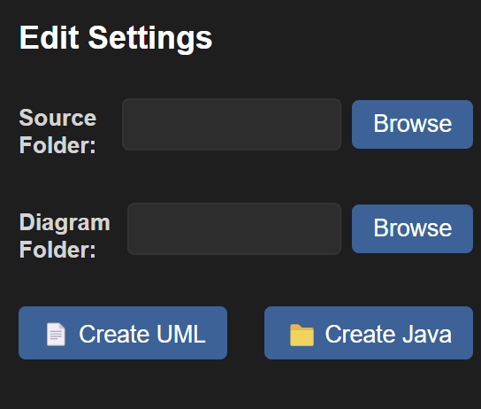
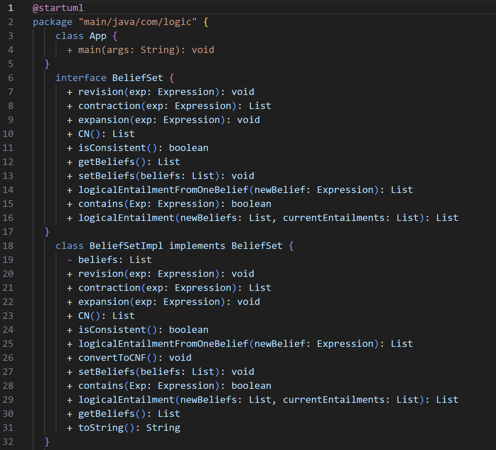
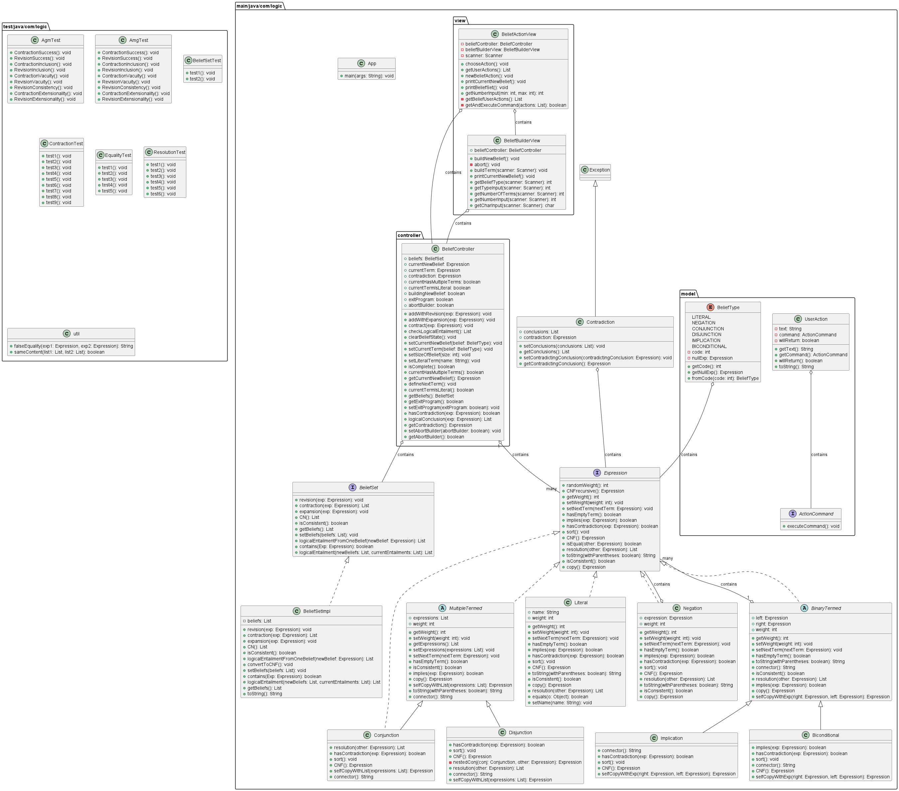
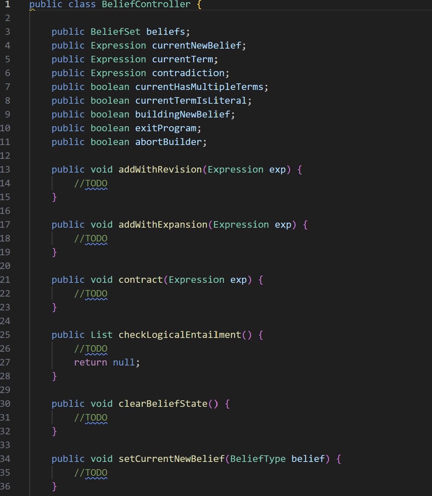
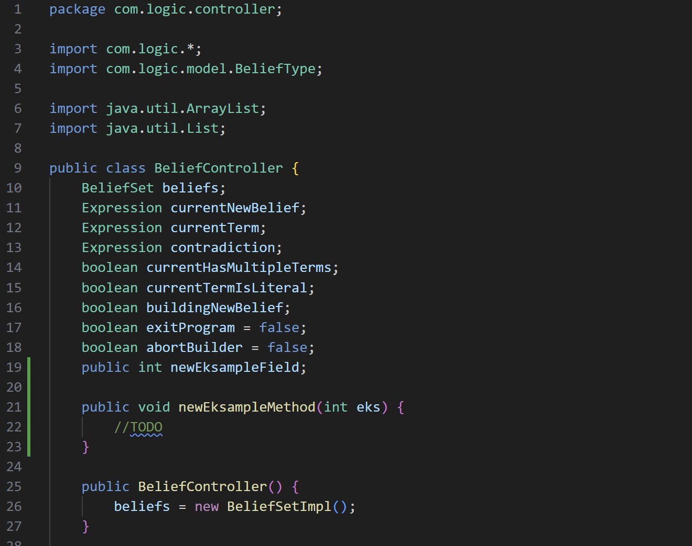

# javauml README

This is the second release of the javaUML extention

## Features
### 1
Save settings for extention uniqly for each project

### 2
Convert Java project into plantUML class diagram

### 3 
Convert plantUML file into a Java project

### 4
Add classes or method and fields to existing classes in the plantUML file then those will be added to the Java project without deleting existing code

## How to use
### Step 1
Install extention, duh
### Step 2
Open a java project
### Step 3
Open up the JavaUML view in the side bar
### Step 4
Select the source folder of your project
### Step 5
Select the output folder (where ever you want your plantUML file to be created)
### Step 6
Create diagrams and java project

## Comming features
### 1
Select and deselect difrent features such as contains arrows
